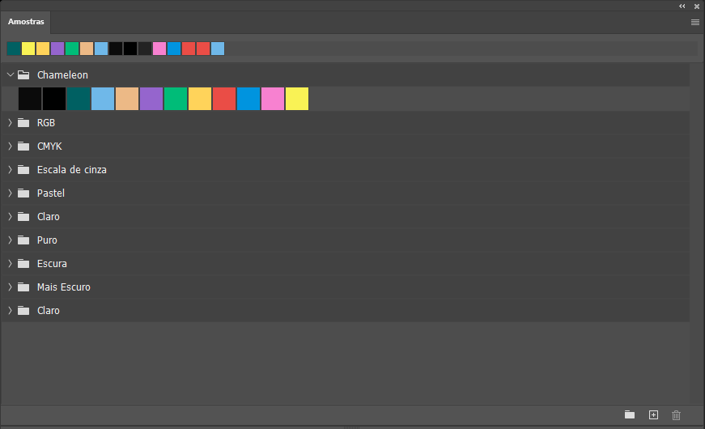

# chameleon for [Adobe](https://www.adobe.com)

> A dark theme for [Adobe](https://www.adobe.com).

## Install

All instructions can be found at [`install.md`](https://github.com/ChameleonTheme/Adobe/blob/master/install.md).

## author

This theme is maintained by [Mario Matsui](https://github.com/MarioMatsui)
 |
--- |
Mario Matsui

---

## Show your support
Give a ⭐️ if this project helped you!
